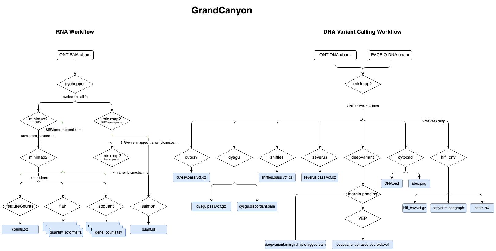

# GrandCanyon

Jetstream workflow to support the T2T Consortium CHM13 reference genome, through both long and short read sequencing data. This 
currently in very early development stages, and contributions are greatly appreciated.


## Current Workflow Overview




## Output Folder Structure

All final output files are placed in a standardized folder structure that generally reflects the relationship of files or
the processing order.
```
Project
|--GeneralLibaryType
|  |--AnalysisType
|  |  |--Tool
|  |  |  |--SampleName
|  |  |     |--ResultFiles
|  |  |--Tool
|  |--AnalysisType
|--GeneralLibaryType
```

<details>
  <summary><b>Project Folder Example</b></summary>

```
# Only Directories are Shown
COLO829
├── genome
│   ├── alignment
│   │   └── minimap2
│   │       ├── COLO829BL_ATCCJJK_p27_CL_1_C3_OUL14
│   │       │   └── stats
│   │       └── COLO829BL_ATCCJJK_p27_CL_1_C3_PSB3G
│   │           └── stats
│   ├── constitutional_variant_calls
│   │   ├── cutesv
│   │   │   └── COLO829BL_ATCCJJK_p27_CL_1_C3_OUL14_minimap2
│   │   │   └── COLO829BL_ATCCJJK_p27_CL_1_C3_PSB3G_minimap2
│   │   ├── deepvariant
│   │   │   └── COLO829BL_ATCCJJK_p27_CL_1_C3_OUL14_minimap2
│   │   │   └── COLO829BL_ATCCJJK_p27_CL_1_C3_PSB3G_minimap2
│   │   ├── dysgu
│   │   │   └── COLO829BL_ATCCJJK_p27_CL_1_C3_OUL14_minimap2
│   │   │   └── COLO829BL_ATCCJJK_p27_CL_1_C3_PSB3G_minimap2
│   │   ├── severus
│   │   │   └── COLO829BL_ATCCJJK_p27_CL_1_C3_OUL14_minimap2
│   │   │   └── COLO829BL_ATCCJJK_p27_CL_1_C3_PSB3G_minimap2
│   │   └── sniffles
│   │       └── COLO829BL_ATCCJJK_p27_CL_1_C3_OUL14_minimap2
│   │       └── COLO829BL_ATCCJJK_p27_CL_1_C3_PSB3G_minimap2
│   ├── constitutional_copy_number
│   │   ├── cytocad
│   │   │   └── COLO829BL_ATCCJJK_p27_CL_1_C3_OUL14_minimap2
│   │   │   └── COLO829BL_ATCCJJK_p27_CL_1_C3_PSB3G_minimap2
│   │   └── hifi_cnv
│   │       └── COLO829BL_ATCCJJK_p27_CL_1_C3_PSB3G_minimap2
│   ├── history
│   └── logs
└── rna
    ├── alignment
    │   └── minimap2
    │       └── COLO829BL_ATCCJJK_p27_CL_1_C3_ORPC9
    │           └── stats
    └── quant
        ├── featureCounts
        │   └── COLO829BL_ATCCJJK_p27_CL_1_C3_ORPC9
        ├── flair
        │   └── COLO829BL_ATCCJJK_p27_CL_1_C3_ORPC9
        ├── isoquant
        │   └── COLO829BL_ATCCJJK_p27_CL_1_C3_ORPC9
        └── salmon
            └── COLO829BL_ATCCJJK_p27_CL_1_C3_ORPC9
```

</details>

## Required Configuration Variables

For each of our data files/fastqs we have some required data, many of which are self explained,
but we will explain the more unique variables. Here is an example:

```json
"dataFiles": [
                {
                        "assayCode" : "OUL14",
                        "dnaRnaMergeKey" : "COLO829BL_ATCCJJK_p27_CL_1",
                        "fastqCode" : "duplex",
                        "fastqPath" : "/path/to/COLO829BL_ATCCJJK_p27_CL_1_C3_OUL14_L81167_PAO93303_NNNNNNNN_L001.duplex.u.bam",
                        "fileType" : "ubam",
                        "fraction" : "1",
                        "glPrep" : "LongRead",
                        "glType" : "GenomePhased",
                        "rgbc" : "NNNNNNNN",
                        "rgcn" : "TGen",
                        "rgid" : "PAO93303_1_NNNNNNNN-NNNNNNNN",
                        "rglb" : "L81167",
                        "rgpl" : "ONT",
                        "rgpm" : "PromethION",
                        "rgpu" : "PAO93303_1",
                        "rgsm" : "COLO829BL_ATCCJJK_p27_CL_1_C3",
                        "rnaStrandDirection" : "NotApplicable",
                        "rnaStrandType" : "NotApplicable",
                        "sampleMergeKey" : "COLO829BL_ATCCJJK_p27_CL_1_C3_OUL14",
                        "sampleName" : "COLO829BL_ATCCJJK_p27_CL_1_C3_OUL14_L81167",
                        "subGroup" : "Constitutional"
                },
                {
                        "assayCode" : "PSB3G",
                        "dnaRnaMergeKey" : "COLO829BL_ATCCJJK_p27_CL_1",
                        "fastqCode" : "hifi",
                        "fastqPath" : "/path/to/COLO829BL_ATCCJJK_p27_CL_1_C3_PSB3G_L82718_a484042d_ACGCACGTA_L001.hifi.u.bam",
                        "fileType" : "ubam",
                        "fraction" : "1",
                        "glPrep" : "LongRead",
                        "glType" : "GenomePhased",
                        "rgbc" : "ACGCACGTACGAGTAT",
                        "rgcn" : "TGen",
                        "rgid" : "a484042d_1_ACGCACGTAAAGGTT",
                        "rglb" : "L82718",
                        "rgpl" : "PACBIO",
                        "rgpm" : "REVIO",
                        "rgpu" : "a484042d_1",
                        "rgsm" : "COLO829BL_ATCCJJK_p27_CL_1_C3",
                        "rnaStrandDirection" : "NotApplicable",
                        "rnaStrandType" : "NotApplicable",
                        "sampleMergeKey" : "COLO829BL_ATCCJJK_p27_CL_1_C3_PSB3G",
                        "sampleName" : "COLO829BL_ATCCJJK_p27_CL_1_C3_PSB3G_L82718",
                        "subGroup" : "Constitutional"
                }
```


## Data file attributes

There are restrictions on what some of these variables can be assigned to, these will be denoted in the [ ]'s.
If the attribute isn't strictly required then it is not included in this list.

  - *assayCode*  
    Used for determining if the sample is DNA/RNA/etc. and adding the corresponding
    tasks to the final workflow. Each sample discovered will take this attribute from
    the first file encountered for that sample in the config file.

  - *fastqCode* [simplex,duplex,hifi]  
    Assigns the format/code for the input data.

  - *fastqPath*   
    Assigns the path to the fastq.

  - *fileType*  
    Assigns the file type.

  - *glPrep* [genome|capture|rna]  
    Used for determining the prep used to create the sample and then modifying how the
    pipeline runs depending on the prep. This is used to configure single cell.

  - *glType* [genome|genomephased|exome|rna]  
    Used for determining if the sample is DNA/RNA/etc. and adding the corresponding
    tasks to the final workflow. Each sample discovered will take this attribute from
    the first file encountered for that sample in the config file.

  - *rg values*  
    These are standards set in the [SAM/BAM Format Specification](https://samtools.github.io/hts-specs/SAMv1.pdf):  
    rgcn - Name of sequencing center producing the read  
    rgid - Read group identifier.  
    rgbc - Barcode sequence identifying the sample or library.  
    rglb - Unique identifier for the library.  
    rgpl - Platform/technology used to produce the reads.  
    rgpm - Platform model. Used to configure platform duplicate marking thresholds. Free-form text providing further details of the platform/technology used.  
    rgpu - Platform unit (e.g., flowcell-barcode.lane for Illumina or slide for SOLiD). Unique identifier.  
    rgsm - Sample. Use pool name where a pool is being sequenced.  

  - *fraction*  
    Relevant to the TGen naming scheme. See TGen Naming Convention.

  - *sampleMergeKey*   
    This is the expected BAM filename and is used to merge data from multiple sequencing
    lanes or flowcells for data from the same specimen (rgsm) tested with the same assay

  - *sampleName*  
    This is the expected base FASTQ filename.

  - *subGroup*   
    Sets where the data file is for tumour or constitutional, changes the analysis of the data file as well as sets
    the distinction of files during somatic analysis.


## TGen Naming Convention
Many of the naming structures used are defined by the standardize naming structure used at TGen that ensures all files
have a unique but descriptive name. It is designed to support serial collection and multiple collections from
difference sources on a single day.  Furthermore, sample processing methods can be encoded.

STUDY_PATIENT_VISIT_SOURCE_FRACTION_SubgroupIncrement_ASSAY_LIBRARY

Patient_ID = STUDY_PATIENT<br/>
Visit_ID = STUDY_PATIENT_VISIT<br/>
Specimen_ID = STUDY_PATIENT_VISIT_SOURCE<br/>
Sample_ID = STUDY_PATIENT_VISIT_SOURCE_FRACTION<br/>
RG.SM = STUDY_PATIENT_VISIT_SOURCE_FRACTION_SubgroupIncrement (VCF file genotype column header)<br/>
sampleMergeKey = STUDY_PATIENT_VISIT_SOURCE_FRACTION_SubgroupIncrement_ASSAY (BAM filename, ensures different assays are not merged together)<br/>


